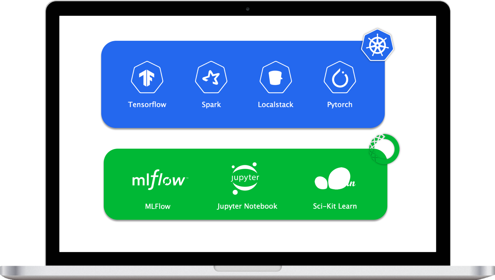

# Machine Learning Stack


[](
://opensource.org/licenses/MIT)

It is common for data scientists to be well equipped in languages and packages commonly used for statistical analysis and modeling. It is less common that data scientists are equipped to properly implement those models in production pipelines.

**MLStack** provides a toolkit for Data Scientists to develop production-level modules in their local development environment.


## Design
<br>
<br>

<p align="center">
    
</p>

<br>

MLStack provides two toolkits with shared dependencies:

- **Conda environment** - An Anaconda environment with common ML python libraries
- **Kubernetes cluster** - A Kubernetes cluster with common ML components


## Getting Started
### Prerequisites
MLStack assumes that you have [Docker](#https://docs.docker.com/) (19.03), [Kubernetes](#https://kubernetes.io/docs/home/) (1.16), and [Conda](#https://docs.conda.io/en/latest/) (4.7) installed. Installation instructions are not given as differents operating systems and environments require specific configuration.

### Install
MLStack can be installed with the following. Note that the setup will take some time as Docker images are pulled and/or built. So grab a cup of :coffee: and relax! (or read logs .. or both)

```sh
# Clone into the repository
git clone https://github.com/sebastianvermaas/mlstack.git
cd mlstack

# Create your mlstack conda environment
conda env create -f conda.yml
conda activate mlstack

# Install the Python library and CLI
pip install -e .

# Setup command for building Docker images
mlstack setup

```


## Usage


### Build
The `mlstack build` command builds the Docker images in the [build](build/) directory. Images that require additional python requirements can be built with the `--requirements` flag. For example:

```bash
mlstack build --image airflow --requirements requirements.txt
```

### Create
The `mlstack create` command creates a Kubernetes cluster specified in the [manifests](manifests/).

```bash

mlstack create
mlstack create --manifest spark --volume-mount mymount --host-path path/to/my/host

```

### Close
The `mlstack delete` command deletes a Kubernetes manifest.

```bash
mlstack close
mlstack close --manifest spark
```

#### TODO
```bash
mlstack create bucket mybucket
mlstack upload data --bucket mybucket
```

