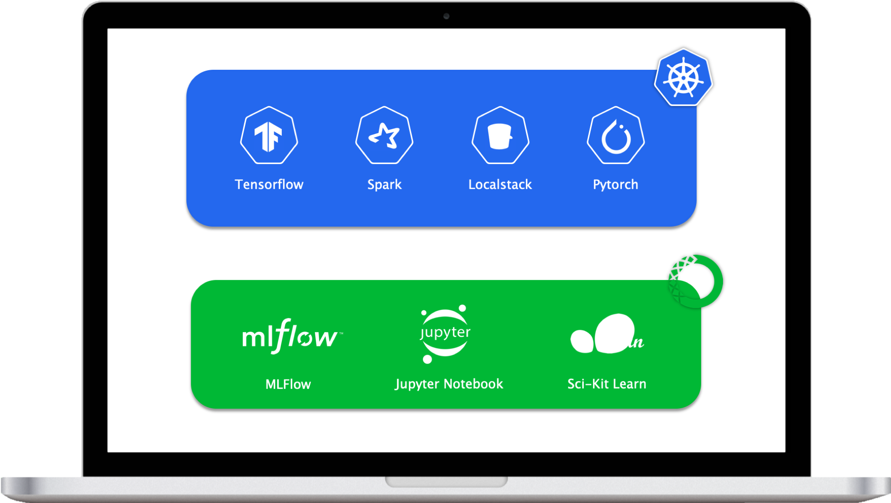

# Machine Learning Stack


It is common for data scientists to be well equipped in languages and packages commonly used for statistical analysis and modeling. It is less common that data scientists are equipped to properly implement those models in production pipelines.

**MLStack** provides a toolkit for Data Scientists to develop production-level modules in their local development environment.


## Design
<br>
<br>

<p align="center">
    
</p>

<br>

## Dependencies
- Docker
- Kubernetes
- Miniconda

## Usage
```bash
mlstack build
mlstack deploy
```
